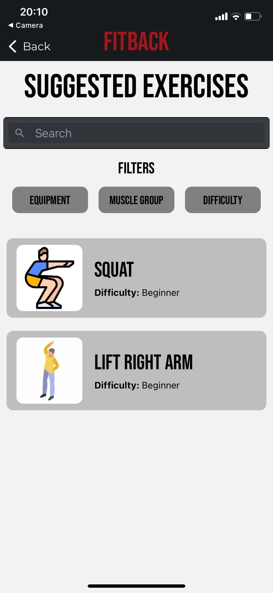

# FitBack

FitBack is a *prototype* of an AR application written in **React Native** that helps people who want to train at home without a human personal trainer. It tries to teach the correct way to perform physical exercises. FitBack can interact with the user while he is performing an exercise and correct him. 

The project was implemented in a group team, for the "Human Computer Interaction" university course.

## Screenshot

### Requirment

- `sudo npm i -g expo-cli`

- Download `Expo Client` in your phone from AppStore\PlayStore

### Usage 

Run 

`cd FitBack` 
 
`npm start` 

in project folder.

Frame the QR Code with Expo phone application to use the application in physical device.

To open in browser

`npx expo install react-native-web@~0.18.9 react-dom@18.1.0 @expo/webpack-config@^0.17.2`

